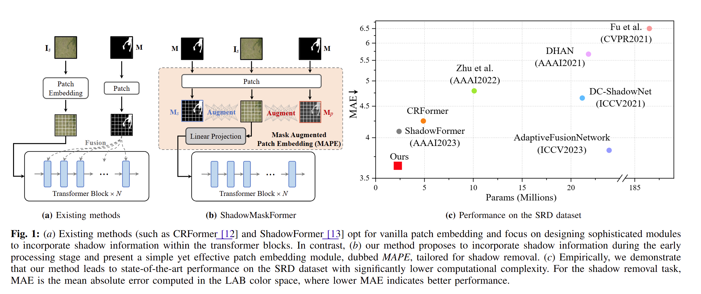
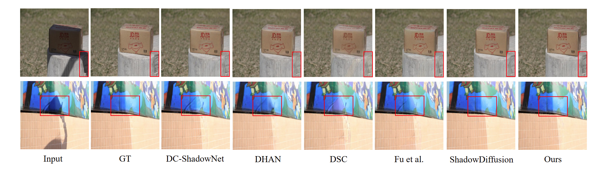
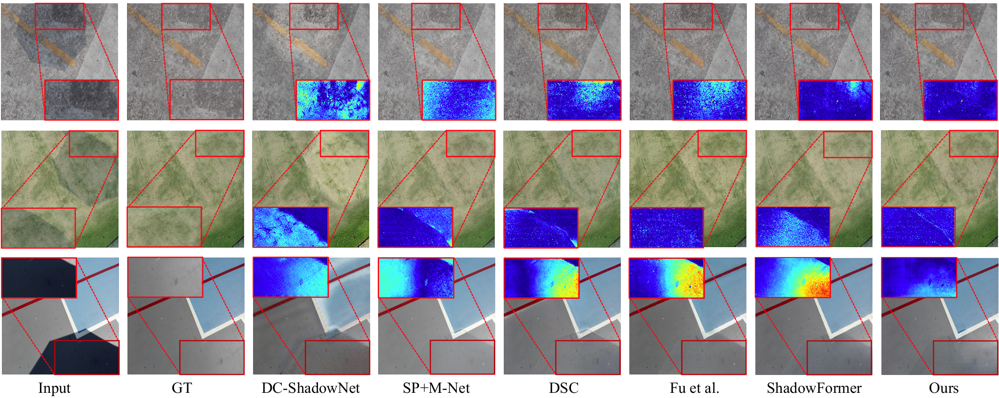

#  ShadowMaskFormer
A simple yet novel transformer-based approach for image shadow removal.
This repository includes code for the following paper:

🚀 **ShadowMaskFormer: Mask Augmented Patch Embedding for Shadow Removal**  
**✅ Accepted in IEEE Transactions on Artificial Intelligence (TAI)**  
**Authors:** Zhuohao Li, Guoyang Xie, Guannan Jiang, & Zhichao Lu.   
**Paper:** [ShadowMaskFormer](https://ieeexplore.ieee.org/document/10938393), [ArXiv](https://ieeexplore.ieee.org/document/10938393)
>***Abstract:***  
*Transformer recently emerged as the de facto model for computer vision tasks and has also been successfully applied to shadow removal. However, these existing methods heavily rely on intricate modifications to the attention mechanisms within the transformer blocks while using a generic patch embedding. As a result, it often leads to complex architectural designs requiring additional computation resources. In this work, we aim to explore the efficacy of incorporating shadow information within the early processing stage. Accordingly, we propose a transformer-based framework with a novel patch embedding that is tailored for shadow removal, dubbed ShadowMaskFormer. Specifically, we present a simple and effective mask-augmented patch embedding to integrate shadow information and promote the model's emphasis on acquiring knowledge for shadow regions. Extensive experiments conducted on the ISTD, ISTD+, and SRD benchmark datasets demonstrate the efficacy of our method against state-of-the-art approaches while using fewer model parameters.*  
<p align="middle">
  
</p>
<p align="middle">
  
</p>
<p align="middle">
  
</p>

# Training Environment
We test the code on PyTorch 1.10.2 + CUDA 11.3 + cuDNN 8.2.0.

1. Create a new conda environment
```
conda create -n shadowmaskformer python=3.7
conda activate shadowmaskformer
```

2. Install dependencies
```
conda install pytorch=1.10.2 torchvision torchaudio cudatoolkit=11.3 -c pytorch
pip install -r requirements.txt
```

# Instructions
Please execute the following instructions to configure the parameters for running the program:

1. Model Training
python train.py --model (model name) --dataset (dataset name) --exp (exp name)
e.g.: python train.py --model shadowmaskformer-b --dataset ISTD --exp istd

2. Model Testing
python test.py --model (model name) --dataset (dataset name) --exp (exp name)
e.g.: python test.py --model shadowmaskformer-b --dataset ISTD --exp istd


# Citation
If our work is helpful for your research, please consider citing:
```
@ARTICLE{10938393,
  author={Li, Zhuohao and Xie, Guoyang and Jiang, Guannan and Lu, Zhichao},
  journal={IEEE Transactions on Artificial Intelligence}, 
  title={ShadowMaskFormer: Mask Augmented Patch Embedding for Shadow Removal}, 
  year={2025},
  volume={},
  number={},
  pages={1-11},
  keywords={Patch Embedding;Shadow Mask;Shadow Removal;Vision Transformer;Deep Learning},
  doi={10.1109/TAI.2025.3554605}}
```
